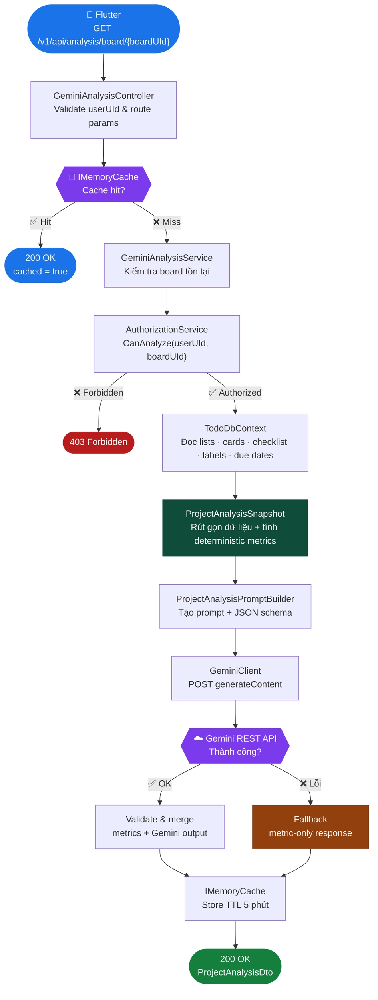
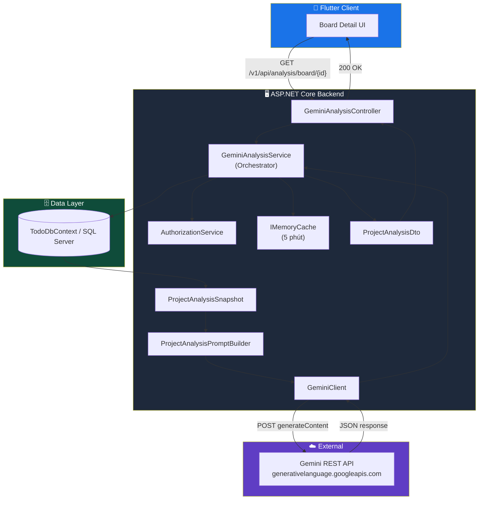
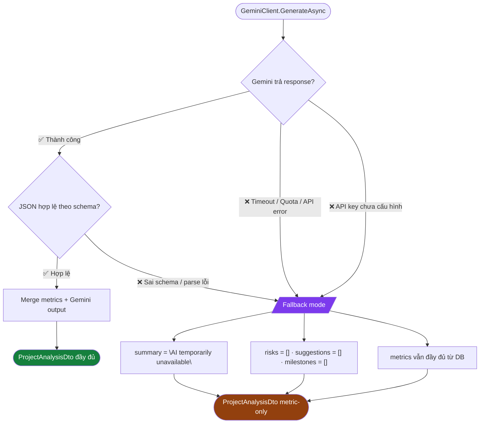
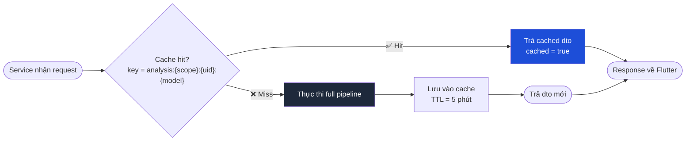

# Luồng kiến trúc Gemini Analysis

## Mục tiêu

Tính năng Gemini Analysis dùng Gemini API để phân tích tiến độ dự án trong TrelloAppClone_V2. Backend chịu trách nhiệm gom dữ liệu, kiểm quyền, gọi Gemini và trả báo cáo có cấu trúc. Flutter chỉ gọi API nội bộ của backend, không gọi Gemini trực tiếp và không giữ API key.

## Luồng tổng quan



## Kiến trúc lớp



## Vai trò từng lớp

### Flutter

- Gọi API backend qua Dio.
- Không gọi Gemini API trực tiếp.
- Không lưu Gemini API key.
- Hiển thị báo cáo gồm tiến độ tổng quan, metrics, risks, suggestions và inferred milestones.
- Với MVP, chỉ expose nút phân tích AI ở Board Detail cho người có quyền Admin/Editor.

### GeminiAnalysisController

Controller nhận request từ Flutter:

```http
GET /v1/api/analysis/workspace/{workspaceUId}?userUId={userUId}
GET /v1/api/analysis/board/{boardUId}?userUId={userUId}
GET /v1/api/analysis/card/{cardUId}?userUId={userUId}
```

Controller chỉ làm việc mỏng:

- Kiểm tra `userUId` không rỗng.
- Gọi `IGeminiAnalysisService`.
- Chuyển kết quả service thành HTTP status:
  - `200 OK` khi thành công.
  - `403 Forbidden` khi user không có quyền.
  - `404 Not Found` khi workspace/board/card không tồn tại.
  - `400 Bad Request` khi thiếu dữ liệu bắt buộc.

### AuthorizationService

Backend kiểm quyền trước khi gom dữ liệu và gọi Gemini.

| Scope | Owner | Admin | Editor | Viewer |
|---|:---:|:---:|:---:|:---:|
| Board analysis | ✅ | ✅ | ✅ | ❌ |
| Workspace analysis | ✅ | ✅ | ❌ | ❌ |
| Card analysis | ✅ | ✅ | ✅ | ❌ |

> **Lý do:** Báo cáo AI tổng hợp nhiều thông tin nhạy cảm → quyền phân tích chặt hơn quyền xem thông thường.

### GeminiAnalysisService

Đây là lớp orchestration chính.

Service thực hiện:

1. Kiểm tra workspace/board/card có tồn tại không.
2. Kiểm tra quyền truy cập qua `AuthorizationService`.
3. Đọc dữ liệu thật từ `TodoDbContext`.
4. Tạo snapshot rút gọn chỉ chứa dữ liệu cần cho phân tích.
5. Tính metrics deterministic từ DB.
6. Tạo prompt và JSON schema.
7. Gọi `IGeminiClient`.
8. Validate kết quả Gemini.
9. Trả `ProjectAnalysisDto`.

Nếu Gemini lỗi, service vẫn trả báo cáo metric-only để frontend không bị crash.

### TodoDbContext

Nguồn dữ liệu chính là database hiện có.

Dữ liệu dùng cho phân tích:

- Board name.
- Lists.
- Cards.
- Card status.
- Card due date.
- Todo items/checklist.
- Card labels.

Dữ liệu không gửi sang Gemini:

- JWT.
- Refresh token.
- Email user.
- Avatar URL.
- API key.
- Attachment URL, trừ khi sau này có yêu cầu rõ ràng.

### ProjectAnalysisSnapshot

Snapshot là dữ liệu đã được rút gọn từ DB trước khi đưa vào prompt.

Ví dụ snapshot board gồm:

- `scopeType`: `board`
- `scopeUId`
- `title`
- danh sách list
- danh sách card
- checklist count
- completed checklist count
- due date
- label names

Snapshot giúp Gemini chỉ nhìn thấy dữ liệu cần thiết, giảm rủi ro lộ thông tin và giảm token.

### Metrics deterministic

Metric là phần đáng tin cậy vì được tính từ DB, không phụ thuộc Gemini.

Các metric chính:

- Tổng số card.
- Số card hoàn thành.
- Số card quá hạn.
- Tổng số todo item/checklist.
- Số todo item đã hoàn thành.
- Overall progress.

Gemini không được tự tính lại metric. Gemini chỉ diễn giải trên metric và snapshot đã cung cấp.

### ProjectAnalysisPromptBuilder

Prompt builder tạo:

- Prompt tiếng Việt/tiếng Anh có ràng buộc rõ.
- Snapshot JSON.
- Metrics đã tính sẵn.
- JSON schema bắt buộc cho Gemini response.

Ràng buộc chính trong prompt:

- Chỉ dùng dữ liệu snapshot.
- Không bịa card ID, deadline, member hoặc milestone.
- Trả lời bằng tiếng Việt.
- Không trả text ngoài JSON.
- Giới hạn số risk/suggestion.

### GeminiClient

`GeminiClient` gọi Gemini bằng REST API:

```http
POST https://generativelanguage.googleapis.com/v1beta/models/{model}:generateContent
Header: x-goog-api-key: {GeminiSettings.ApiKey}
Header: Content-Type: application/json
```

API key chỉ nằm trong backend config/user-secrets/env var.

Request có `generationConfig.responseFormat` để ép Gemini trả JSON theo schema.

### ProjectAnalysisDto

Đây là response cuối cùng trả về Flutter.

Response gồm:

- `scopeType`
- `scopeUId`
- `title`
- `overallProgress`
- `summary`
- `risks`
- `suggestions`
- `metrics`
- `breakdown`
- `inferredMilestones`
- `generatedAt`
- `model`
- `cached`

## Fallback khi Gemini lỗi



## Cache



**Cache key format:** `analysis:{scopeType}:{scopeUId}:{userUId}:{model}`

| Mục tiêu | Lợi ích |
|---|---|
| Giảm gọi Gemini lặp lại | Tiết kiệm quota / cost |
| Giảm latency | Phản hồi nhanh cho các lần xem gần nhau |
| Giảm tải DB | Snapshot chỉ query 1 lần / 5 phút |

> Hiện tại chưa lưu lịch sử report vào DB. DB history là phase sau.

## Nguyên tắc thiết kế chính

- Backend là nơi duy nhất gọi Gemini.
- API key không bao giờ đi xuống Flutter.
- DB metrics là nguồn tin cậy.
- Gemini chỉ diễn giải, cảnh báo rủi ro và gợi ý hành động.
- Response Gemini luôn phải được validate.
- Feature vẫn hoạt động ở chế độ metric-only khi Gemini lỗi.
- Viewer không được phân tích board.

