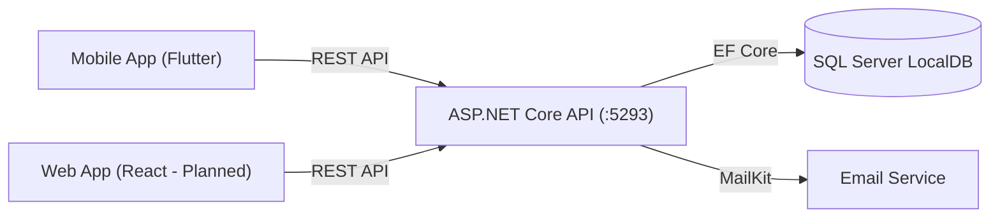

# Kabo — Workspace, Board & Task Management System

> **Kabo** là một nền tảng quản lý công việc và dự án, sao chép lại các tính năng cốt lõi của Trello.
> Dự án tự phát triển bằng **C# ASP.NET Core 8** cho Backend, **Flutter** (Clean Architecture) cho ứng dụng Mobile, và dự kiến sẽ thêm ứng dụng Web bằng **React**.

---

## 1. Tech Stack Tổng Quan

### Backend (REST API)

| Thành phần | Công nghệ | Ghi chú |
| --- | --- | --- |
| Framework | **ASP.NET Core 8.0** Web API | Xây dựng API chuẩn REST |
| Ngôn ngữ | **C# 12** | |
| CSDL | SQL Server | Dùng **EF Core 9.0.8** làm ORM |
| Xác thực | JWT & BCrypt | Token base (Access & Refresh) |
| Email / OTP | MailKit | Gửi Email xác nhận mã OTP, tính năng 2FA |
| API Docs | Swagger | Cho phép test dễ dàng từ trình duyệt |
| Khác | Docker | Đã cấu hình `Dockerfile` cho phép build |

### Frontend Mobile (App)

| Thành phần | Công nghệ | Ghi chú |
| --- | --- | --- |
| Framework | **Flutter** (Dart ^3.11.0) | Cross platform |
| Kiến trúc | Clean Architecture | Chia làm Domain - Data - Presentation |
| State Management | **flutter_bloc** 8.1.3 | Quản lý theo cấu trúc Bloc/Cubit |
| Networking | Dio + CookieJar | Hỗ trợ cấu hình base URL & Authen-Interceptor (tự refesh JWT Token) |
| UI | Material & Custom Dark Theme | `primary: #579DFF`, `background: #1D2125` |

### Web Frontend (Kế Hoạch)

| Thành phần | Công nghệ | Ghi chú |
| --- | --- | --- |
| Framework | **React** (Dự kiến SPA) | Kết nối cùng một API |

---

## 2. Cấu Trúc Dự Án

### Sơ đồ luồng ứng dụng



### Thư mục dự án

```text
TrelloAppClone_V2/
├── C#/TodoAppAPI/                  # Backend 
│   ├── Configurations/             # EF Core configurations cho các Entity
│   ├── Controllers/                # 16 REST API controllers 
│   ├── Data/                       # TodoDbContext mapping các Entity tới CSDL
│   ├── DTOs/                       # Các Data Transfer Objects 
│   ├── Interfaces/                 # Các Abstract Interfaces dùng cho DI
│   ├── Models/                     # Entity Classes (User, Board, Card, List, Workspace...)
│   ├── Service/                    # Chứa mọi Bussiness Logic (VD: AuthService, CardService...)
│   │   ├── Email/                  # Gửi Email Service
│   │   └── JWT/                    # Token Creation
│   ├── Seeders/                    # Class tạo dữ liệu mồi
│   ├── appsettings.json            # Cấu hình chuỗi kết nối và thông số cấu hình khác
│   └── Program.cs                  # DI Setup và Middleware 
│
├── Flutter/kabo_flutter/          # Mobile Frontend App
│   ├── lib/
│   │   ├── core/                   # Shared Modules dùng chung cho ứng dụng
│   │   │   ├── common_widgets/
│   │   │   ├── constants/
│   │   │   ├── network/            # DioClient & HTTP Interceptors
│   │   │   └── services/           # Storage (Local Data)
│   │   │
│   │   ├── features/               # Phân chia ứng dụng theo từng chức năng (Feature-based)
│   │   │   ├── activity/
│   │   │   ├── auth/               # Xác thực, 2FA, OTP
│   │   │   ├── board/              # Tính năng chính để quản lý Bảng
│   │   │   ├── card/               
│   │   │   ├── inbox/
│   │   │   ├── planner/
│   │   │   └── profile/
│   │   │
│   │   ├── init_dependencies.dart  # File chứa Service Locator Registration cho các Model
│   │   ├── main.dart               # Theme setup và khởi tạo 
│   │   └── routes.dart             # Named routes (/login, /home...vv)
│   └── pubspec.yaml                # Khai báo packages của Flutter
│
└── Web/                            # React Project (Dự kiến xây dựng sau này)
```

---

## 3. Kiến Trúc Dữ Liệu (Backend Entities)

Cơ chế quản lý ứng dụng cho phép User thuộc về tổ chức Workspace, hay tạo Bảng riêng.
Đây là các bảng Models và mối liên kết:

1. **User (Tài khoản):** Quản lý thông tin xác thực, Trạng thái tài khoản và 2FA. `UserUId` là khóa chính dạng GUID string.
2. **Workspace (Không gian làm việc):** Nơi chứa dự án team, bao gồm `WorkspaceMemberDto` lưu quyền hạn của người dùng trong tổ chức. 
3. **Board (Bảng):** Một dự án thuộc Workspace (hoặc Personal/cá nhân). Quản lý thành viên qua `BoardMember`.
4. **List (Danh sách):** Các trạng thái cột thẻ trong `Board` (VD: TODO, DOING, DONE...). Quyết định theo trường `Position`.
5. **Card (Thẻ):** Đơn vị công việc thuộc về `List` (nếu không nằm trong List tức thuộc Inbox thẻ chưa giao của User `UserInboxCard`). Thông tin bổ trợ gồm `TodoItems` ( Checklist ), `Comment` và được gắn cho Assignee với `CardMember`.
6. **Activity & Notification:** Sử dụng để track Event, theo dõi quá trình log lịch sử hành động hệ thống trả về thông báo phía Client/App.

---

## 4. Các Tính Năng (Features)

### 4.1 Người dùng & Xác Thực (Auth)
- Hệ thống hỗ trợ đăng nhập cơ bản và hỗ trợ OAuth (Google Login).
- Có cơ chế xác thực Email OTP (Mã pin 6 số).
- Có cơ chế Two-Factor Authentication (2FA) bảo mật hai lớp.
- Token JWT dùng Cookie, do frontend gọi Auth API lấy token về và interceptor phía Client cấp phát Access Token.

### 4.2 Các Bảng & Không Gian Làm Việc (Workspace & Boards)
- Chức năng CRUD cơ bản từ Endpoint.
- Chỉ định và thay đổi cập nhật phân quyền (`BoardRole` ví dụ: Trưởng nhóm/Viewer).
- Bảng có chia quyền Public / Workspace / Private.

### 4.3 Thẻ (Cards)
- Thiết lập chi tiết về tiêu đề, Due Date (Ngày hạn), và ghi chú chi tiết.
- Tính năng checklist `TodoItem` tích hợp ngay bên trong card để thực hành các công việc theo tiến trình. 
- Comment/Bình luận: Cho phép Member trò chuyện với nhau.

### 4.4 Flow Hệ Thống Bổ Trợ (Activities / Notifications)
- Mọi API tạo, sửa, đổi của backend đều log lại hành động ở bảng `Activity` (Service AddActivity).
- Mọi tương tác tag user, mời hoặc giao nhận card đều tự động tạo ra một `Notification` hướng tới Client.

---

## 5. Cấu Trúc App Mobile

Được phân bổ thiết kế theo chuẩn Clean Architecture tạo ra các tính năng.

### Các Layer của một Feature (Ví dụ: tính năng `board` mẫu chuẩn ứng dụng)
`domain` ( Lớp Không phụ thuộc )
-  `entities`: Object của nghiệp vụ.
-  `repositories`: Abstract Class (interfaces).
-  `usecases`: Phương thức gọi chức năng.

 `data` 
-  `models`: Mở rộng từ Entity để hỗ trợ serialization (fromJson/toJson).
-  `datasources`: Implement quá trình gọi Dio Fetch dữ liệu theo HTTP.
-  `repositories`: Các Repositority implement các phương thức abstract khai báo trên dùng Datasource trả ngược dữ liệu. 

`presentation` 
-  `bloc / cubit`: Các Event , State giúp update thay đổi trên giao diện người dùng.
-  `widgets / pages`: Mã nguồn Flutter, components. 

### Các Trang hiển thị
1. Tab **Bảng** (Quản lý các dự án, mở bảng ra là thấy danh sách List và Card dạng cột của Trello).
2. Tab **Hộp thư đến** (Nhận thông báo chung, Card gán cho mình).
3. Tab **Kế hoạch** (Xem các Card hạn mức).
4. Tab **Hoạt động** (Xem lịch sử Event).
5. Tab **Tài khoản** (Setting cá nhân).

---

## 6. Lộ Trình Phát Triển (Roadmap)

### Backend (C# 8.0)
- ✅ Setup dự án, Database EF & Migrations.
- ✅ API Xác thực (Register, Login, Google OAuth, RefreshToken, 2FA, Email OTP).
- ✅ CRUD cho Workspace, Board, List, Card, TodoItem, Comment.
- ✅ Cấu hình Activity & Notification Event.

### Mobile App (Flutter)
- ✅ Setup UI, Framework & Base Clean Architecture.
- ✅ Tích hợp State Management ( Bloc + GetIt locator ). 
- ✅ Phát triển các luồng giao diện 5 Tab + Board List dạng Trello.
- 🟡 Kết nối với Backend thông qua các luồng Network ( Hiện trạng Auth API cần ghép luồng Domain / Data chưa hoàn tất 100% ).
- 🟡 Triển khai màn xác nhận Email trên trang `VerifyPage` (Sau khi setup Login gọi Api Verify / Tích hợp xử lý các Exceptions) (Xem chi tiết trên file `implementation_plan.md`). 

### Web App (React) (Sắp tới)
- 🟡 Xây dựng cấu trúc dự án React / TypeScript.
- 🟡 Phát triển UI, luồng tương tác React-dnd (Kéo thả React component).
- 🟡 Cấu hình và tương tác với các Endpoint API C# tương tự App. 
