# Tài Liệu Phân Tích & Thiết Kế Hệ Thống Trello Clone

> **Ứng dụng:** TrellOn – Hệ thống quản lý công việc theo mô hình Kanban  
> **Nền tảng:** Flutter (Mobile) + ASP.NET Core 9 (Backend API) + SQL Server  
> **Phiên bản tài liệu:** 1.0  

---

# PHẦN 1: PHÂN TÍCH HỆ THỐNG

---

## 1.1 Sơ Đồ Phân Cấp Chức Năng (BFD)

```
TrellOn – Hệ thống quản lý công việc
│
├── 1. Quản lý Tài khoản & Xác thực
│   ├── 1.1 Đăng ký tài khoản
│   │   ├── 1.1.1 Nhập thông tin đăng ký (email, mật khẩu, tên)
│   │   └── 1.1.2 Xác minh email (gửi OTP / token)
│   ├── 1.2 Đăng nhập
│   │   ├── 1.2.1 Đăng nhập bằng email + mật khẩu (JWT)
│   │   └── 1.2.2 Đăng nhập qua OAuth (Google, v.v.)
│   ├── 1.3 Xác thực hai yếu tố (2FA)
│   │   ├── 1.3.1 Bật/tắt 2FA
│   │   ├── 1.3.2 Xác thực TOTP code
│   │   └── 1.3.3 Dùng backup code
│   ├── 1.4 Quản lý phiên đăng nhập (session / refresh token)
│   └── 1.5 Quên & đặt lại mật khẩu
│
├── 2. Quản lý Hồ sơ Người dùng
│   ├── 2.1 Xem & chỉnh sửa thông tin cá nhân (tên, bio)
│   ├── 2.2 Thay đổi avatar (tải lên Cloudinary)
│   └── 2.3 Xem lịch sử hoạt động cá nhân
│
├── 3. Quản lý Không gian Làm việc (Workspace)
│   ├── 3.1 Tạo workspace mới
│   ├── 3.2 Xem danh sách workspace của tôi
│   ├── 3.3 Chỉnh sửa thông tin workspace
│   ├── 3.4 Xóa workspace
│   └── 3.5 Quản lý thành viên workspace
│       ├── 3.5.1 Mời thành viên vào workspace
│       ├── 3.5.2 Thay đổi vai trò thành viên (Admin / Member)
│       └── 3.5.3 Xóa thành viên khỏi workspace
│
├── 4. Quản lý Bảng (Board)
│   ├── 4.1 Tạo bảng mới (cá nhân / trong workspace)
│   ├── 4.2 Xem danh sách bảng
│   │   ├── 4.2.1 Bảng gần đây (Recent Boards)
│   │   ├── 4.2.2 Bảng cá nhân
│   │   └── 4.2.3 Bảng trong workspace nhóm
│   ├── 4.3 Chỉnh sửa bảng
│   │   ├── 4.3.1 Đổi tên bảng
│   │   ├── 4.3.2 Thay đổi phông nền (ảnh / màu sắc từ Cloudinary)
│   │   └── 4.3.3 Thay đổi quyền hiển thị (Private / Public / Workspace)
│   ├── 4.4 Chuyển bảng sang workspace khác (Transfer)
│   ├── 4.5 Xóa / Lưu trữ bảng
│   └── 4.6 Quản lý thành viên bảng
│       ├── 4.6.1 Thêm thành viên vào bảng
│       ├── 4.6.2 Cập nhật vai trò thành viên (Owner / Admin / Member / Guest)
│       └── 4.6.3 Xóa thành viên khỏi bảng
│
├── 5. Quản lý Danh sách (List / Column)
│   ├── 5.1 Tạo danh sách mới trong bảng
│   ├── 5.2 Đổi tên danh sách
│   ├── 5.3 Xóa danh sách
│   └── 5.4 Sắp xếp lại thứ tự các danh sách (kéo-thả / reorder)
│
├── 6. Quản lý Thẻ Công việc (Card)
│   ├── 6.1 Tạo thẻ mới trong danh sách
│   ├── 6.2 Xem chi tiết thẻ
│   ├── 6.3 Chỉnh sửa thẻ
│   │   ├── 6.3.1 Đổi tiêu đề / mô tả
│   │   ├── 6.3.2 Đặt ngày hết hạn (Due date)
│   │   ├── 6.3.3 Thay đổi trạng thái thẻ (To Do / In Progress / Completed)
│   │   └── 6.3.4 Đặt phông nền thẻ
│   ├── 6.4 Di chuyển thẻ
│   │   ├── 6.4.1 Kéo-thả giữa các danh sách trong cùng bảng
│   │   └── 6.4.2 Sắp xếp lại vị trí trong danh sách
│   ├── 6.5 Phân công người thực hiện (Card Member)
│   │   ├── 6.5.1 Thêm thành viên vào thẻ
│   │   └── 6.5.2 Xóa thành viên khỏi thẻ
│   ├── 6.6 Gắn nhãn màu (Label)
│   │   ├── 6.6.1 Thêm nhãn vào thẻ
│   │   └── 6.6.2 Gỡ nhãn khỏi thẻ
│   ├── 6.7 Danh sách việc cần làm (Todo Items / Checklist)
│   │   ├── 6.7.1 Thêm todo item
│   │   ├── 6.7.2 Đánh dấu hoàn thành
│   │   └── 6.7.3 Xóa todo item
│   ├── 6.8 Bình luận trên thẻ
│   │   ├── 6.8.1 Viết bình luận
│   │   ├── 6.8.2 Chỉnh sửa bình luận
│   │   └── 6.8.3 Xóa bình luận
│   ├── 6.9 Đính kèm tệp tin (File Attachment)
│   │   ├── 6.9.1 Tải tệp lên (Cloudinary)
│   │   └── 6.9.2 Xóa tệp đính kèm
│   └── 6.10 Xóa thẻ
│
├── 7. Hộp thư đến (Inbox / UserInboxCard)
│   ├── 7.1 Xem danh sách thẻ được phân công
│   └── 7.2 Điều hướng đến thẻ từ inbox
│
├── 8. Thông báo (Notification)
│   ├── 8.1 Nhận thông báo khi có thay đổi liên quan
│   ├── 8.2 Xem danh sách thông báo chưa đọc
│   └── 8.3 Đánh dấu thông báo đã đọc
│
└── 9. [Tương lai] Các tính năng mở rộng
    ├── 9.1 Lịch (Calendar view) – xem card theo due date
    ├── 9.2 Tích hợp chatbot / AI
    ├── 9.3 Báo cáo & thống kê tiến độ
    ├── 9.4 Tích hợp API bên thứ ba (Zapier, Slack…)
    └── 9.5 Thông báo nhắc việc (Reminder / Push Notification)
```

---

## 1.2 Bảng Phân Tích: Tiến Trình, Tác Nhân và Hồ Sơ

| STT | Tiến trình | Tác nhân chính | Tác nhân phụ | Hồ sơ đầu vào | Hồ sơ đầu ra |
|-----|-----------|---------------|--------------|---------------|--------------|
| 1 | Đăng ký / Xác minh email | Người dùng mới | Hệ thống email | Thông tin đăng ký | Tài khoản + email xác nhận |
| 2 | Đăng nhập (JWT) | Người dùng | Hệ thống JWT | Email + mật khẩu | Access token + Refresh token |
| 3 | Xác thực 2FA | Người dùng | Hệ thống TOTP | OTP code / backup code | Phiên đăng nhập hợp lệ |
| 4 | Tạo Workspace | Chủ sở hữu | — | Tên & mô tả workspace | Workspace mới |
| 5 | Mời thành viên Workspace | Chủ sở hữu / Admin | Người được mời | UserUId + Role | WorkspaceMember record |
| 6 | Tạo Board | Người dùng | — | Tên, workspace, background | Board mới |
| 7 | Chuyển Board sang Workspace | Owner của Board | — | BoardId + WorkspaceId đích | Board được cập nhật workspace |
| 8 | Tạo List | Admin / Member Board | — | Tên danh sách | List mới trong Board |
| 9 | Tạo Card | Thành viên Board | — | Tiêu đề + ListId | Card mới |
| 10 | Kéo-thả Card | Thành viên Board | — | CardId + ListId đích + vị trí | Card được cập nhật vị trí |
| 11 | Kéo-thả List | Admin Board | — | ListId + vị trí mới | Thứ tự lists được cập nhật |
| 12 | Phân công thành viên Card | Thành viên Board | Người được phân công | CardId + UserUId | CardMember record + Notification |
| 13 | Bình luận trên Card | Thành viên Board | — | CardId + Nội dung | Comment record |
| 14 | Đính kèm tệp | Thành viên Board | Cloudinary | CardId + File | FileUrl record |
| 15 | Hoàn thành Todo Item | Thành viên Board | — | TodoItemId + trạng thái | TodoItem cập nhật |
| 16 | Xem Bảng Gần Đây | Người dùng | — | UserUId | Danh sách 4 Board gần nhất |
| 17 | Nhận & đọc Notification | Người dùng | — | UserUId | Danh sách thông báo |
| 18 | Tải lên / thay đổi Avatar | Người dùng | Cloudinary | File ảnh | AvatarUrl |
| 19 | Xóa Board / List / Card | Owner / Admin | — | Entity ID | Xóa khỏi DB |
| 20 | Ghi nhật ký hoạt động | Hệ thống | — | Hành động + Actor | Activity record |

---

## 1.3 Biểu Đồ Luồng Dữ Liệu (DFD)

### Mức 0 – Ngữ cảnh (Context Diagram)

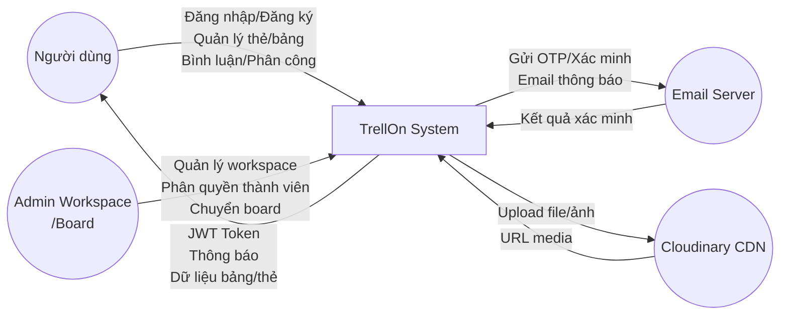

---

### Mức 1 – Đỉnh (Level 0 DFD)

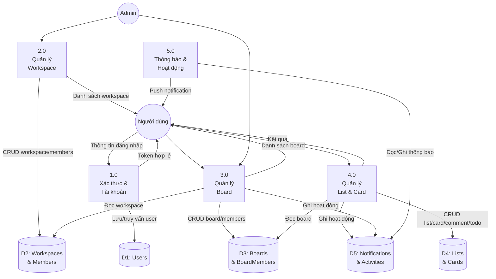

---

### Mức 2 – Dưới Đỉnh: Tiến trình 1.0 – Quản lý Người dùng (User)

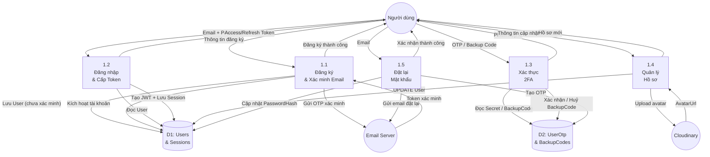

---

### Mức 2 – Dưới Đỉnh: Tiến trình 2.0 – Quản lý Workspace

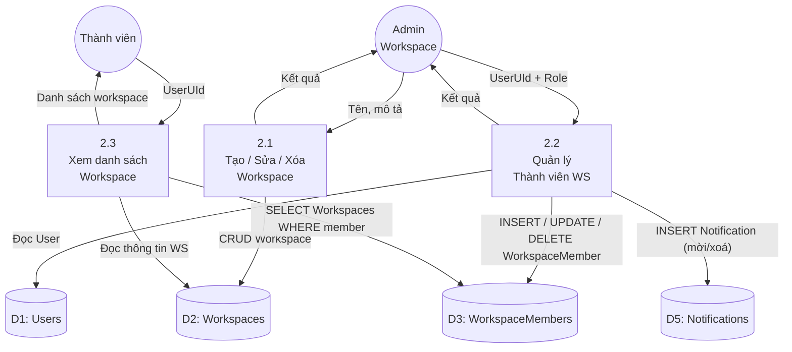

---

### Mức 2 – Dưới Đỉnh: Tiến trình 3.0 – Quản lý Board

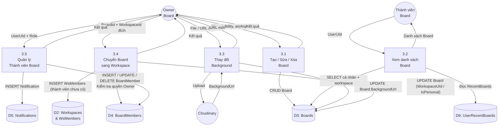

---

### Mức 2 – Dưới Đỉnh: Tiến trình 5.0 – Thông báo & Hoạt động

```mermaid
graph TB
    U((Người dùng))
    SYS((Hệ thống\n[tiến trình khác]))

    P51[5.1\nTạo &\nGửi thông báo]
    P52[5.2\nXem & Đọc\nthông báo]
    P53[5.3\nGhi nhật ký\nhoạt động]

    DS5N[(D5a: Notifications)]
    DS5A[(D5b: Activities)]
    DS1[(D1: Users)]

    SYS -- "Sự kiện (phân công, mời, cập nhật)" --> P51
    P51 -- "Đọc thông tin recipient" --> DS1
    P51 -- "INSERT Notification" --> DS5N
    P51 -- "Thông báo realtime" --> U

    U -- "UserUId" --> P52
    P52 -- "SELECT Notifications WHERE recipientId" --> DS5N
    P52 -- "Danh sách thông báo" --> U
    U -- "Đánh dấu đã đọc" --> P52
    P52 -- "UPDATE Notification.Read = true" --> DS5N

    SYS -- "Hành động + Actor" --> P53
    P53 -- "INSERT Activity" --> DS5A
    U -- "UserUId" --> P53
    P53 -- "SELECT Activities" --> DS5A
    P53 -- "Lịch sử hoạt động" --> U
```

---

### Mức 2 – Dưới Đỉnh: Tiến trình 6.0 – Hộp thư đến (Inbox)

```mermaid
graph TB
    U((Người dùng))
    SYS(Hệ thống\n[CardMember])

    P61[6.1\nThêm Card\nvào Inbox]
    P62[6.2\nXem danh sách\nInbox]
    P63[6.3\nĐiều hướng\nđến Card]

    DS_IC[(D7: UserInboxCards)]
    DS_C[(D4b: Cards\n& Lists)]
    DS_B[(D3: Boards)]

    SYS -- "CardId + UserUId (được phân công)" --> P61
    P61 -- "INSERT UserInboxCard (nếu chưa tồn tại)" --> DS_IC
    P61 -- "Thêm vào inbox" --> U

    U -- "UserUId" --> P62
    P62 -- "SELECT InboxCards JOIN Cards JOIN Lists JOIN Boards" --> DS_IC
    P62 -- "Danh sách thẻ được phân công" --> U

    U -- "Chọn thẻ" --> P63
    P63 -- "Đọc CardId + BoardId" --> DS_C
    P63 -- "Điều hướng đến Board + Card" --> U
```

---

### Mức 2 – Dưới Đỉnh: Tiến trình 4.0 – Quản lý List & Card


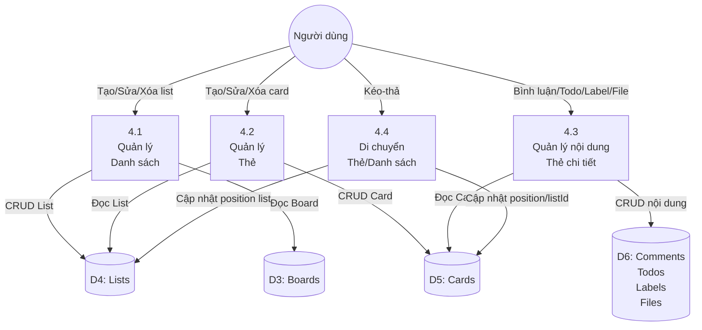

---

## 1.4 Use Case Diagram

```mermaid
graph TB
    subgraph Actors
        A(( Người dùng\nmới))
        B(( Thành viên\nBoard))
        C(( Admin /\nOwner Board))
        D(( Admin\nWorkspace))
    end

    subgraph "Xác thực & Tài khoản"
        UC1[Đăng ký tài khoản]
        UC2[Đăng nhập]
        UC3[Xác thực 2FA]
        UC4[Đặt lại mật khẩu]
        UC5[Cập nhật hồ sơ]
    end

    subgraph "Workspace"
        UC6[Tạo workspace]
        UC7[Xem/Sửa workspace]
        UC8[Quản lý thành viên WS]
    end

    subgraph "Board"
        UC9[Tạo board]
        UC10[Xem danh sách board]
        UC11[Đổi tên / Background board]
        UC12[Thay đổi Visibility]
        UC13[Chuyển Board sang WS khác]
        UC14[Quản lý thành viên Board]
    end

    subgraph "List & Card"
        UC15[Tạo / Sắp xếp List]
        UC16[Tạo / Xem Card]
        UC17[Chỉnh sửa Card]
        UC18[Kéo-thả Card / List]
        UC19[Phân công thành viên Card]
        UC20[Gắn nhãn Label]
        UC21[Thêm Checklist / Todo]
        UC22[Bình luận]
        UC23[Đính kèm tệp]
    end

    subgraph "Thông báo"
        UC24[Nhận thông báo]
        UC25[Xem Inbox Card]
    end

    A --> UC1
    A --> UC2
    B --> UC2
    B --> UC3
    B --> UC4
    B --> UC5
    B --> UC10
    B --> UC15
    B --> UC16
    B --> UC17
    B --> UC18
    B --> UC19
    B --> UC20
    B --> UC21
    B --> UC22
    B --> UC23
    B --> UC24
    B --> UC25
    C --> UC9
    C --> UC11
    C --> UC12
    C --> UC13
    C --> UC14
    D --> UC6
    D --> UC7
    D --> UC8
```

### 1.4.1 Đặc tả chi tiết các Use Case

#### Nhóm 1: Xác thực và Tài khoản

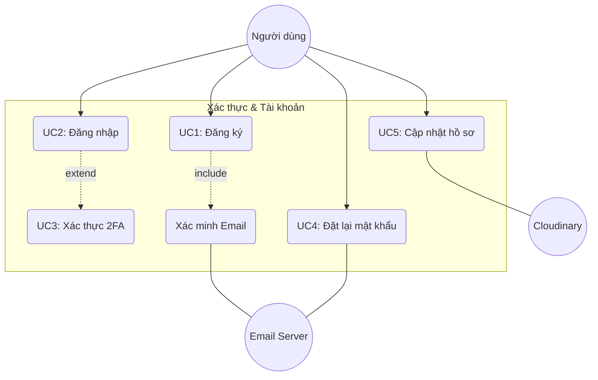

**UC1: Đăng ký tài khoản**
- **Tác nhân:** Người dùng mới.
- **Tiền điều kiện:** Người dùng chưa có tài khoản hoặc email chưa được đăng ký.
- **Hậu điều kiện:** Tài khoản được tạo và ở trạng thái "Chờ xác minh" hoặc "Đã kích hoạt".
- **Luồng sự kiện:**
  1. Người dùng chọn chức năng Đăng ký.
  2. Hệ thống hiển thị form nhập: Tên, Email, Mật khẩu.
  3. Người dùng nhập thông tin và nhấn "Đăng ký".
  4. Hệ thống kiểm tra hợp lệ: Email đúng định dạng, chưa tồn tại, mật khẩu đủ độ mạnh.
  5. Hệ thống gửi mã OTP xác nhận về email của người dùng.
  6. Người dùng nhập mã OTP vào ứng dụng.
  7. Hệ thống xác thực mã và kích hoạt tài khoản.
- **Ngoại lệ:** Email đã tồn tại -> Hệ thống yêu cầu đăng nhập hoặc dùng email khác.

**UC2: Đăng nhập**
- **Tác nhân:** Người dùng.
- **Luồng sự kiện:**
  1. Người dùng nhập Email và Mật khẩu.
  2. Hệ thống kiểm tra thông tin đăng nhập trong DB.
  3. Nếu chính xác, hệ thống kiểm tra cài đặt 2FA.
  4. Nếu không bật 2FA, hệ thống tạo mã JWT (AccessToken & RefreshToken) và trả về cho App.
  5. Nếu bật 2FA, chuyển sang UC3.
- **Ngoại lệ:** Sai mật khẩu quá 5 lần -> Khóa tài khoản tạm thời.

**UC3: Xác thực 2FA**
- **Tác nhân:** Người dùng.
- **Luồng sự kiện:**
  1. Sau khi nhập đúng email/mật khẩu, hệ thống yêu cầu mã xác thực.
  2. Người dùng mở app xác thực (Google Authenticator) hoặc kiểm tra email lấy mã.
  3. Người dùng nhập mã vào hệ thống.
  4. Hệ thống kiểm tra mã hợp lệ và cấp quyền truy cập.

**UC4: Đặt lại mật khẩu**
- **Tác nhân:** Người dùng.
- **Luồng sự kiện:**
  1. Người dùng chọn "Quên mật khẩu" tại màn hình đăng nhập.
  2. Nhập email đăng ký.
  3. Hệ thống kiểm tra sự tồn tại của email và gửi link/mã đặt lại mật khẩu.
  4. Người dùng sử dụng link/mã để nhập mật khẩu mới.
  5. Hệ thống cập nhật PasswordHash mới vào DB.

**UC5: Cập nhật hồ sơ**
- **Tác nhân:** Người dùng.
- **Luồng sự kiện:**
  1. Người dùng truy cập "Cài đặt tài khoản".
  2. Thay đổi thông tin: Tên hiển thị, Bio, hoặc tải lên ảnh đại diện mới.
  3. Hệ thống tải ảnh lên Cloudinary (nếu có) và lưu URL vào DB.
  4. Phản hồi cập nhật thành công.

#### Nhóm 2: Quản lý Không gian làm việc (Workspace)

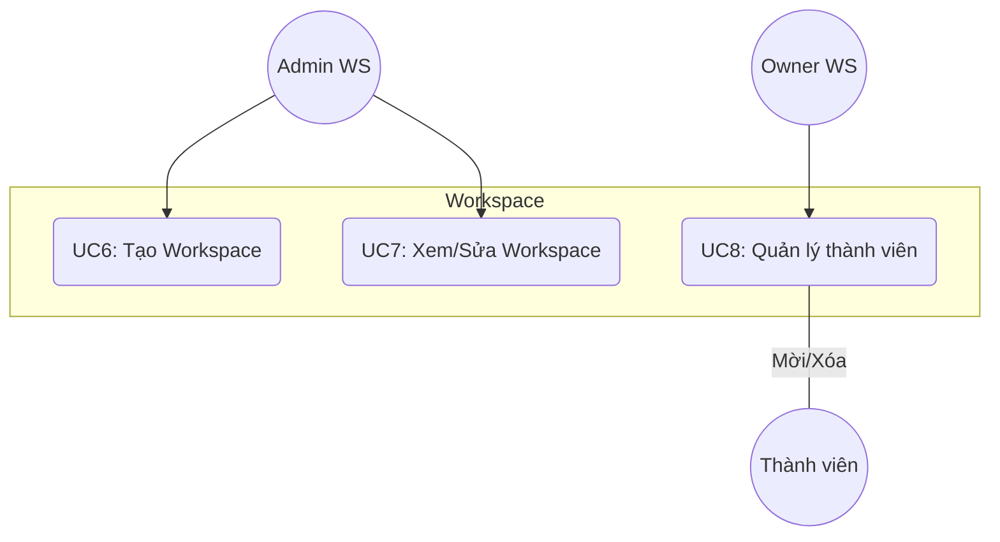

**UC6: Tạo Workspace**
- **Tác nhân:** Admin Workspace.
- **Luồng sự kiện:**
  1. Người dùng nhấn "Tạo Workspace mới".
  2. Nhập tên Workspace, loại hình và mô tả.
  3. Hệ thống tạo bản ghi Workspace và mặc định gán người tạo là "Owner".
  4. Workspace hiển thị trên danh sách bên trái.

**UC7: Xem/Sửa Workspace**
- **Tác nhân:** Thành viên (Xem), Admin (Sửa).
- **Luồng sự kiện:**
  1. Người dùng chọn một Workspace từ danh sách.
  2. Hệ thống hiển thị thông tin chung và danh sách các bảng bên trong.
  3. Admin có thể sửa tên hoặc xóa Workspace (chỉ dành cho Owner).

**UC8: Quản lý thành viên Workspace**
- **Tác nhân:** Admin Workspace.
- **Luồng sự kiện:**
  1. Admin mở tab "Members" trong Workspace.
  2. Nhấn "Invite" và nhập Email của thành viên muốn mời.
  3. Hệ thống kiểm tra User hiện có và gửi thông báo mời.
  4. Admin có thể thay đổi vai trò (Admin/Member) hoặc xóa thành viên khỏi WS.

#### Nhóm 3: Quản lý Bảng (Board)

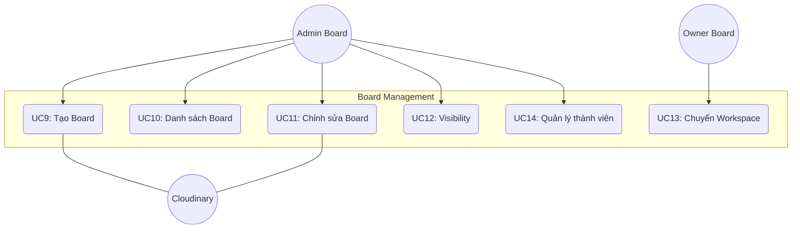

**UC9: Tạo Board**
- **Tác nhân:** Owner/Admin Board.
- **Luồng sự kiện:**
  1. Người dùng nhấn "Create Board".
  2. Nhập tên Board, chọn Background (Màu hoặc Ảnh từ thư viện Cloudinary).
  3. Chọn Workspace để chứa Board (hoặc chọn No Workspace cho Board cá nhân).
  4. Chọn quyền hiển thị (Private, Workspace, Public).
  5. Hệ thống khởi tạo Board và 3 List mặc định (To Do, Doing, Done).

**UC10: Xem danh sách Board**
- **Tác nhân:** Người dùng.
- **Luồng sự kiện:**
  1. Hệ thống tự động tải danh sách Board người dùng có quyền truy cập.
  2. Phân loại theo: Board gần đây, Starred Boards, và Board theo từng Workspace.

**UC11: Chỉnh sửa trang trí Board**
- **Tác nhân:** Admin Board.
- **Luồng sự kiện:**
  1. Truy cập cài đặt Board.
  2. Thay đổi tên Board hoặc chọn Background mới.
  3. Hệ thống cập nhật giao diện ngay lập tức cho tất cả người dùng đang xem.

**UC12: Thay đổi Visibility**
- **Tác nhân:** Admin Board.
- **Luồng sự kiện:**
  1. Admin thay đổi trạng thái từ Private sang Workspace hoặc Public.
  2. Hệ thống cập nhật quyền truy cập: Public cho phép mọi người xem, Workspace cho phép thành viên WS xem.

**UC13: Chuyển Board sang Workspace khác**
- **Tác nhân:** Owner Board.
- **Luồng sự kiện:**
  1. Chọn chức năng "Move Board".
  2. Chọn Workspace đích.
  3. Hệ thống cập nhật WorkspaceUId của Board và thông báo cho các thành viên liên quan.

**UC14: Quản lý thành viên Board**
- **Tác nhân:** Admin Board.
- **Luồng sự kiện:**
  1. Chọn "Members" trong Board.
  2. Tìm kiếm thành viên theo tên hoặc email.
  3. Thêm thành viên vào Board và gán vai trò.
  4. Hệ thống tạo thông báo mời tham gia Board.

#### Nhóm 4: Quản lý List & Card

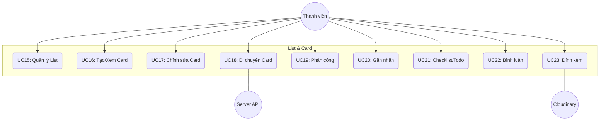

**UC15: Tạo / Sắp xếp List**
- **Tác nhân:** Thành viên Board.
- **Luồng sự kiện:**
  1. Nhấn "Add List" ở cuối danh sách các cột.
  2. Nhập tên List và Enter.
  3. Người dùng có thể kéo thả List để thay đổi thứ tự ưu tiên các cột.

**UC16: Tạo / Xem Card**
- **Tác nhân:** Thành viên Board.
- **Luồng sự kiện:**
  1. Nhấn "Add Card" trong một List cụ thể.
  2. Nhập tiêu đề nhanh.
  3. Nhấn vào Card đã tạo để mở màn hình "Card Detail" hiển thị đầy đủ thông tin.

**UC17: Chỉnh sửa Card**
- **Tác nhân:** Thành viên Board.
- **Luồng sự kiện:**
  1. Tại màn hình Card Detail, người dùng sửa tiêu đề hoặc thêm mô tả (Markdown support).
  2. Chọn "Due Date" để đặt ngày hoàn thành công việc.
  3. Hệ thống tự động lưu các thay đổi nhỏ.

**UC18: Kéo-thả Card (Di chuyển)**
- **Tác nhân:** Thành viên Board.
- **Luồng sự kiện:**
  1. Người dùng kéo Card từ List A sang List B.
  2. Hoặc kéo Card lên/xuống trong cùng List A để đổi vị trí.
  3. Hệ thống lưu position mới và cập nhật ListId tương ứng trong DB.

**UC19: Phân công thành viên Card**
- **Tác nhân:** Thành viên Board.
- **Luồng sự kiện:**
  1. Trong Card Detail, chọn mục "Members".
  2. Tick chọn các thành viên trong Board tham gia thẻ này.
  3. Hệ thống tạo bản ghi `CardMember` và gửi thông báo cho người được phân công.

**UC20: Gắn nhãn Label**
- **Tác nhân:** Thành viên Board.
- **Luồng sự kiện:**
  1. Chọn "Labels".
  2. Chọn các nhãn màu có sẵn hoặc tạo nhãn mới với màu sắc tùy chỉnh.
  3. Nhãn hiển thị ngay trên mặt trước của Card.

**UC21: Thêm Checklist/Todo**
- **Tác nhân:** Thành viên Board.
- **Luồng sự kiện:**
  1. Chọn "Checklist", nhập tên checklist.
  2. Thêm các đầu việc (Todo items).
  3. Khi người dùng tick hoàn thành, hệ thống cập nhật thanh tiến độ (%) của Card.

**UC22: Bình luận (Comment)**
- **Tác nhân:** Thành viên Board.
- **Luồng sự kiện:**
  1. Nhập nội dung vào ô Comment phía dưới Card Detail.
  2. Hệ thống lưu bình luận kèm thời gian và thông tin người viết.
  3. Các thành viên khác theo dõi thẻ này sẽ nhận được thông báo.

**UC23: Đính kèm tệp**
- **Tác nhân:** Thành viên Board.
- **Luồng sự kiện:**
  1. Chọn "Attachments" -> "Computer".
  2. Chọn tệp tin.
  3. Hệ thống upload lên Cloudinary, lưu URL và hiển thị danh sách tệp đính kèm trong Card.

#### Nhóm 5: Thông báo & Hộp thư

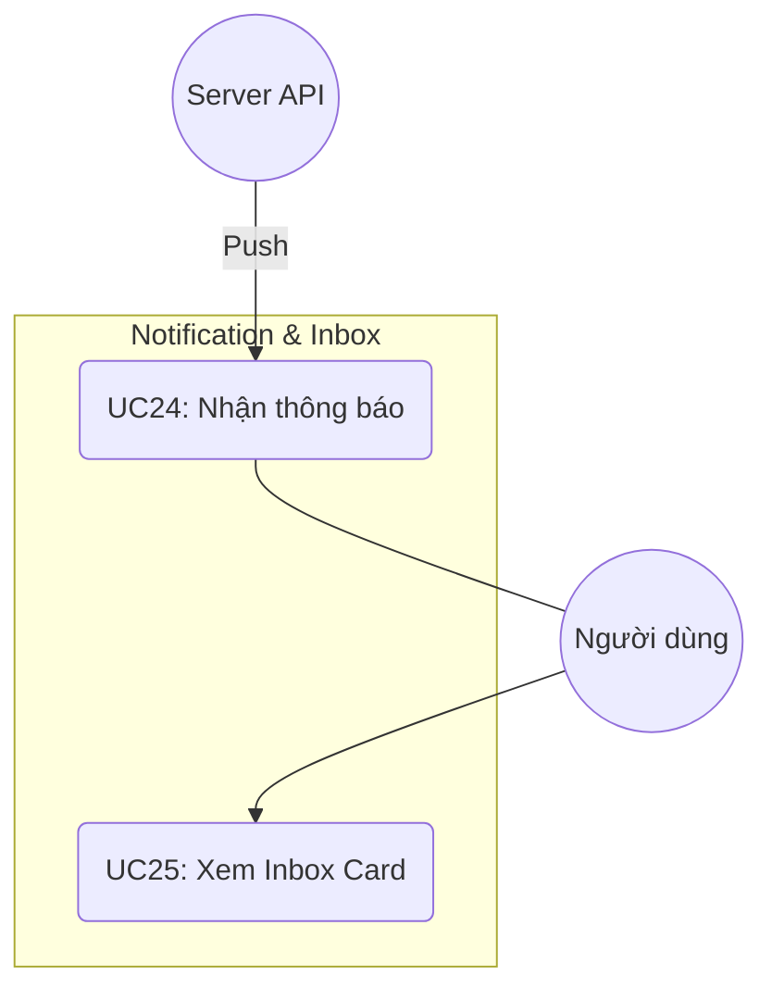

**UC24: Nhận thông báo**
- **Tác nhân:** Người dùng.
- **Luồng sự kiện:**
  1. Khi có sự kiện: Được mời vào Board/WS, được phân công Card, hoặc có comment mới.
  2. Hệ thống tạo bản ghi Notification.
  3. Người dùng thấy chấm đỏ tại Icon thông báo và có thể xem danh sách.

**UC25: Xem Inbox Card**
- **Tác nhân:** Người dùng.
- **Luồng sự kiện:**
  1. Người dùng truy cập tab "Inbox".
  2. Hệ thống hiển thị tất cả các Card mà người dùng được phân công trên toàn bộ hệ thống.
  3. Người dùng nhấn vào Card để nhảy trực tiếp đến Board chứa Card đó.

---

## 1.5 Activity Diagram – Quy trình tạo và xử lý thẻ công việc

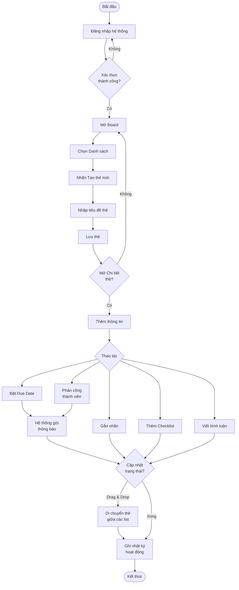

---

## 1.6 Sơ đồ Trạng thái (State Diagram)

### 1.6.1 Trạng thái Tài khoản Người dùng
Mô tả vòng đời của một tài khoản từ khi đăng ký đến khi hoạt động hoặc bị khóa.

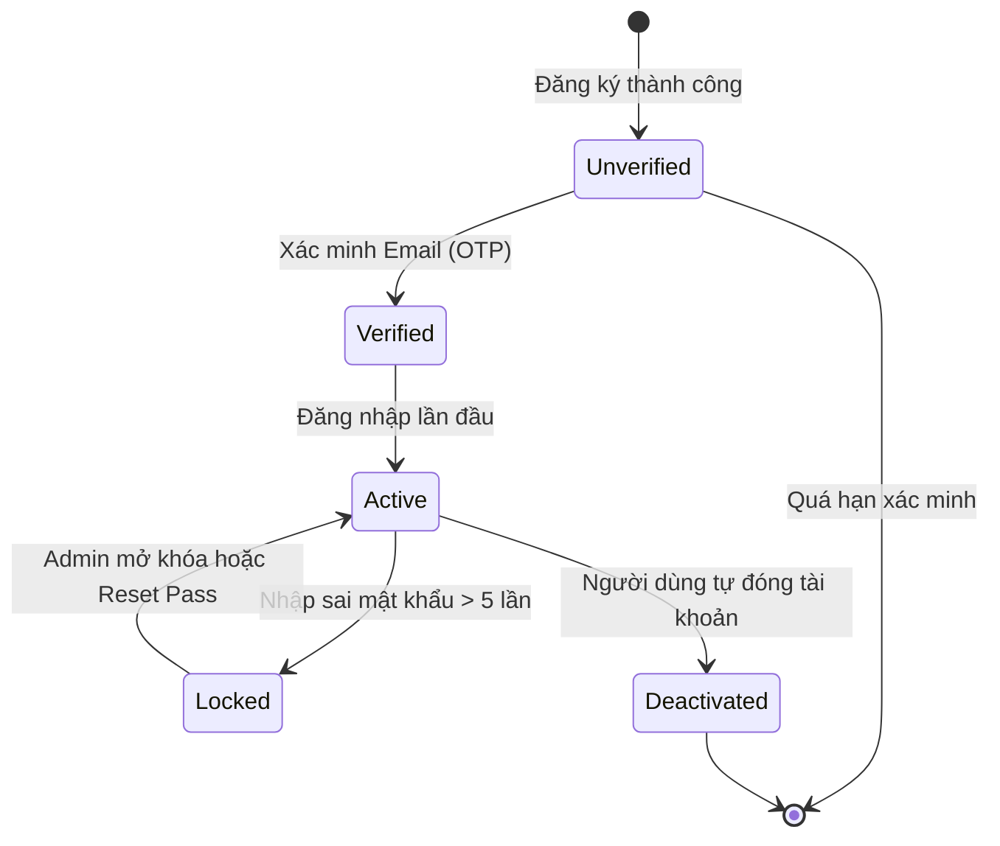

### 1.6.2 Trạng thái Thẻ công việc (Card)
Mô tả sự luân chuyển của một thẻ công việc thông qua các trạng thái xử lý.

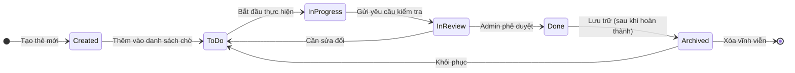

---

## 1.7 Sơ đồ BPMN (Business Process Model and Notation)

### 1.7.1 Quy trình xử lý và hoàn thành thẻ công việc
Dưới đây là sơ đồ quy trình nghiệp vụ phối hợp giữa các vai trò trong một Board.

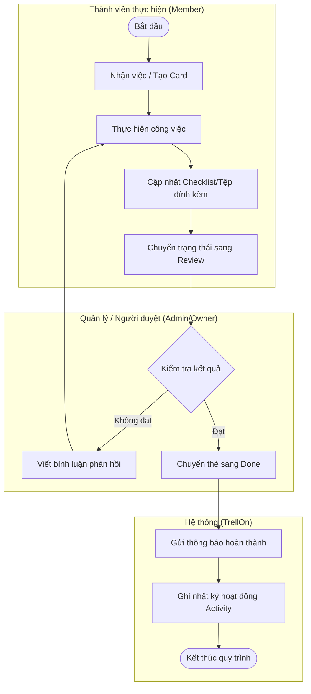

### 1.7.2 Quy trình mời và phân quyền thành viên
Quy trình nghiệp vụ khi một Admin mời người dùng mới vào hệ thống làm việc.

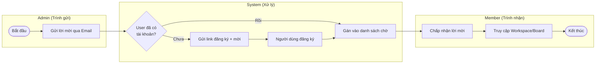

---

# PHẦN 2: THIẾT KẾ HỆ THỐNG

---

## 2.1 Class Diagram (Biểu Đồ Lớp)


---

### 2.1.1 Bảng Mô Tả Thực Thể

| Thực thể | Thuộc tính chính | Khóa chính | Khóa ngoại | Mục đích |
|---------|----------------|-----------|-----------|---------|
| **User** | UserName, Email, PasswordHash, AvatarUrl, IsTwoFactorEnabled | UserUId | RoleId | Lưu thông tin tài khoản và xác thực |
| **Workspace** | Name, Description, Status | WorkspaceUId | OwnerUId (→User) | Không gian làm việc nhóm |
| **WorkspaceMembers** | Role, JoinedAt | WorkspaceMemberUId | WorkspaceUId, UserUId | Quản lý thành viên workspace với phân quyền |
| **Board** | BoardName, IsPersonal, Visibility, BackgroundUrl | BoardUId | UserUId (→User), WorkspaceUId (→Workspace) | Bảng kanban, cốt lõi của hệ thống |
| **BoardMember** | BoardRole, JoinedAt | BoardMemberUId | BoardUId, UserUId | Phân quyền thành viên trong board |
| **List** | ListName, Position, Status | ListUId | BoardUId (→Board) | Cột trong bảng kanban (To Do, In Progress...) |
| **Card** | Title, Description, DueDate, Position, Status | CardUId | ListUId (→List), UserUId | Đơn vị công việc cụ thể |
| **CardMember** | AssignedAt | CardMemberUId | CardUId, UserUId | Phân công người thực hiện thẻ |
| **CardLabel** | LabelName, Color | CardLabelUId | CardUId (→Card) | Nhãn màu phân loại thẻ |
| **Comment** | Content, CreatedAt | CommentUId | CardUId, UserUId | Thảo luận trên thẻ |
| **TodoItem** | Content, IsCompleted | TodoItemUId | CardUId (→Card) | Checklist công việc nhỏ trong thẻ |
| **FileUrl** | Url, FileName | FileId | CardUId (→Card) | Tệp đính kèm trên thẻ (lưu qua Cloudinary) |
| **Notification** | Type, Title, Message, Read | NotiId | RecipientId, ActorId (→User) | Thông báo sự kiện trong hệ thống |
| **Activity** | Description, CreatedAt | ActivityId | UserUId (→User) | Nhật ký hoạt động người dùng |
| **UserRecentBoard** | LastVisitedAt | UserRecentBoardUId | UserUId, BoardUId | Lịch sử truy cập board gần đây (tối đa 4) |
| **UserInboxCard** | — | InboxCardUId | UserUId, CardUId | Hộp thư: thẻ được phân công cho user |

---

## 2.2 Sequence Diagram

### 2.2.1 Đăng nhập và lấy danh sách Board

```mermaid
sequenceDiagram
    actor U as Người dùng
    participant App as Flutter App
    participant API as ASP.NET Core API
    participant DB as SQL Server
    participant Cache as Local Storage

    U->>App: Nhập email + mật khẩu
    App->>API: POST /v1/api/auth/login
    API->>DB: SELECT User WHERE Email = ?
    DB-->>API: User record
    API->>API: Verify PasswordHash (BCrypt)
    alt 2FA bật
        API-->>App: Yêu cầu OTP
        App->>U: Hiển thị màn hình OTP
        U->>App: Nhập OTP
        App->>API: POST /v1/api/auth/verify-2fa
    end
    API->>API: Tạo JWT AccessToken
    API-->>App: { accessToken, refreshToken }
    App->>Cache: Lưu token + userId
    App->>API: GET /v1/api/board?userUId=...
    API->>DB: SELECT Boards (personal + workspace)
    DB-->>API: Board list + recent boards
    API-->>App: JSON Board list
    App->>U: Hiển thị trang chủ
```

---

### 2.2.2 Kéo-thả thẻ giữa các danh sách (Optimistic Update)

```mermaid
sequenceDiagram
    actor U as Người dùng
    participant App as Flutter App
    participant Cubit as BoardDetailCubit
    participant API as ASP.NET Core API
    participant DB as SQL Server

    U->>App: Kéo Card từ List A sang List B (vị trí X)
    App->>Cubit: moveCard(card, sourceListId, targetListId, insertIndex)
    Cubit->>Cubit: Lưu _previousLists (rollback snapshot)
    Cubit->>Cubit: Optimistic update: cập nhật UI ngay lập tức
    Cubit-->>App: emit BoardDetailLoaded (lists mới)
    App->>U: UI ngay lập tức phản hồi

    Cubit->>API: PUT /v1/api/cards/{cardId}/move?newListId=...
    API->>DB: UPDATE Card SET ListUId = ?, Position = ?
    DB-->>API: Success

    alt Thành công
        API-->>Cubit: 200 OK
    else Thất bại
        API-->>Cubit: 4xx/5xx Error
        Cubit->>Cubit: Rollback về _previousLists
        Cubit-->>App: emit BoardDetailLoaded (lists cũ + transientError)
        App->>U: Hiển thị SnackBar lỗi
    end
```

---

### 2.2.3 Chuyển Board sang Workspace khác

```mermaid
sequenceDiagram
    actor OW as Owner Board
    participant App as Flutter App
    participant Sheet as TransferWorkspaceSheet
    participant Cubit as BoardDetailCubit
    participant API as ASP.NET Core API
    participant DB as SQL Server

    OW->>App: Mở Board Settings → Chọn "Không gian làm việc"
    App->>Sheet: Hiển thị TransferWorkspaceSheet
    Sheet->>API: GET /v1/api/workspace?userUId=...
    API->>DB: SELECT Workspaces WHERE UserUId = ?
    DB-->>API: Danh sách workspace
    API-->>Sheet: Workspace list (có dấu tích WS hiện tại)
    OW->>Sheet: Chọn Workspace đích / Không gian cá nhân
    Sheet->>Sheet: Hiển thị Dialog xác nhận
    OW->>Sheet: Xác nhận chuyển
    Sheet->>Cubit: transferBoardWorkspace(newWorkspaceId, name)
    Cubit->>API: POST /v1/api/boardMember/{boardId}/transfer-workspace?newWorkspaceUId=...
    API->>API: Kiểm tra requester là Owner
    alt Chuyển về Personal
        API->>DB: UPDATE Board SET WorkspaceUId = NULL, IsPersonal = true
    else Chuyển sang Workspace mới
        API->>DB: UPDATE Board SET WorkspaceUId = ?, IsPersonal = false
        API->>DB: INSERT WorkspaceMembers (các thành viên board chưa có)
    end
    DB-->>API: Success
    API-->>Cubit: 200 OK { message }
    Cubit->>Cubit: emit state mới với workspaceId mới
    Cubit-->>App: SnackBar " Đã chuyển bảng thành công"
```

---

### 2.2.4 Phân công thành viên thẻ và gửi thông báo

```mermaid
sequenceDiagram
    actor A as Thành viên Board
    participant App as Flutter App
    participant API as ASP.NET Core API
    participant DB as SQL Server

    A->>App: Mở Card → Tab Thành viên
    App->>API: GET /v1/api/boardMember/{boardId}/members
    API->>DB: SELECT BoardMembers JOIN Users
    DB-->>API: Danh sách thành viên board
    API-->>App: Member list

    A->>App: Chọn thêm thành viên vào card
    App->>API: POST /v1/api/cardMember/{cardId}/add?userUId=...
    API->>DB: INSERT CardMember
    API->>DB: INSERT UserInboxCard (nếu chưa có)
    API->>DB: INSERT Notification (type=CardAssigned, recipientId=userUId)
    DB-->>API: Success
    API-->>App: 200 OK
    App->>A: UI cập nhật danh sách thành viên card

    Note over DB,App: Thành viên được phân công nhận thông báo<br/>khi mở app lần tiếp theo
```

---

## 2.3 Activity Diagram (Mức Thiết Kế)

### 2.3.1 Thuật toán xử lý Đăng nhập + 2FA

```mermaid
flowchart TD
    S([Start]) --> Input[Nhận email + password]
    Input --> FindUser{Tìm User\ntrong DB?}
    FindUser -- Không tìm thấy --> ErrUser[Trả về 401\nUser không tồn tại]
    ErrUser --> End1([End])

    FindUser -- Tìm thấy --> CheckPwd{BCrypt.Verify\n(password, hash)?}
    CheckPwd -- Sai --> ErrPwd[Trả về 401\nSai mật khẩu]
    ErrPwd --> End2([End])

    CheckPwd -- Đúng --> CheckEmail{IsEmailVerified?}
    CheckEmail -- Không --> ErrEmail[Trả về 403\nEmail chưa xác minh]
    ErrEmail --> End3([End])

    CheckEmail -- Có --> Check2FA{IsTwoFactorEnabled?}
    Check2FA -- Không --> GenToken[Tạo JWT AccessToken\n+ RefreshToken]
    Check2FA -- Có --> Return2FA[Trả về 200\n+ flag require2FA]
    Return2FA --> Wait[Client gửi OTP code]
    Wait --> VerifyOTP{TOTP.Verify\n(secret, code)?}
    VerifyOTP -- Sai --> CheckBackup{Backup Code\nhợp lệ?}
    CheckBackup -- Không --> ErrOTP[Trả về 401\nSai OTP]
    ErrOTP --> End4([End])
    CheckBackup -- Có --> GenToken
    VerifyOTP -- Đúng --> GenToken

    GenToken --> SaveSession[Lưu UserSession\nvào DB]
    SaveSession --> LogActivity[Ghi Activity\n'User signed in']
    LogActivity --> Response[Trả về 200\n{ accessToken, refreshToken }]
    Response --> End5([End])
```

---

### 2.3.2 Thuật toán xử lý di chuyển thẻ (Move Card)

```mermaid
flowchart TD
    S([Start]) --> CheckAuth{User là thành viên\nBoard?}
    CheckAuth -- Không --> Err403[Trả về 403]
    Err403 --> End1([End])

    CheckAuth -- Có --> GetCard{Tìm Card\ntrong DB?}
    GetCard -- Không --> Err404[Trả về 404]
    Err404 --> End2([End])

    GetCard -- Có --> GetTargetList{Tìm List đích\ntrong cùng Board?}
    GetTargetList -- Không --> Err400[Trả về 400\nList không hợp lệ]
    Err400 --> End3([End])

    GetTargetList -- Có --> UpdateCard[UPDATE Card:\nListUId = target\nPosition = insertIndex]
    UpdateCard --> ShiftPositions[Cập nhật Position\ncác card còn lại trong\ncả 2 list]
    ShiftPositions --> SaveDB[SaveChangesAsync]
    SaveDB --> LogActivity[Ghi Activity]
    LogActivity --> Response[Trả về 200 OK]
    Response --> End4([End])
```

---

### 2.3.3 Thuật toán lưu Board gần đây (Recent Board)

```mermaid
flowchart TD
    S([Start: User mở Board]) --> LoadBoard[loadBoard được gọi]
    LoadBoard --> SaveRecent[saveRecentBoardUseCase\n(userUId, boardId)]

    SaveRecent --> CheckExist{UserRecentBoard\ntồn tại?}
    CheckExist -- Có --> UpdateTime[UPDATE LastVisitedAt = Now]
    CheckExist -- Không --> InsertNew[INSERT UserRecentBoard mới]

    UpdateTime --> CountAll[Đếm tổng record\ncủa userUId]
    InsertNew --> CountAll

    CountAll --> CheckLimit{Count > 4?}
    CheckLimit -- Không --> SaveDB[SaveChangesAsync]
    CheckLimit -- Có --> DeleteOld[Xóa các record cũ\n vượt quá 4 mục\norderd by LastVisitedAt DESC]
    DeleteOld --> SaveDB

    SaveDB --> End([End])
```

---

*Tài liệu được tạo tự động dựa trên phân tích mã nguồn thực tế của dự án TrellOn.*
*Cập nhật lần cuối: 2026-05-10*
